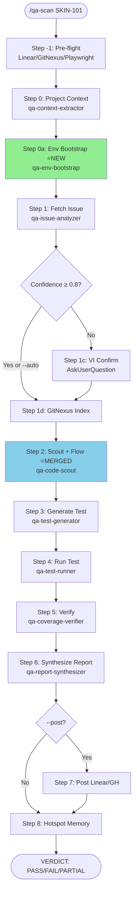
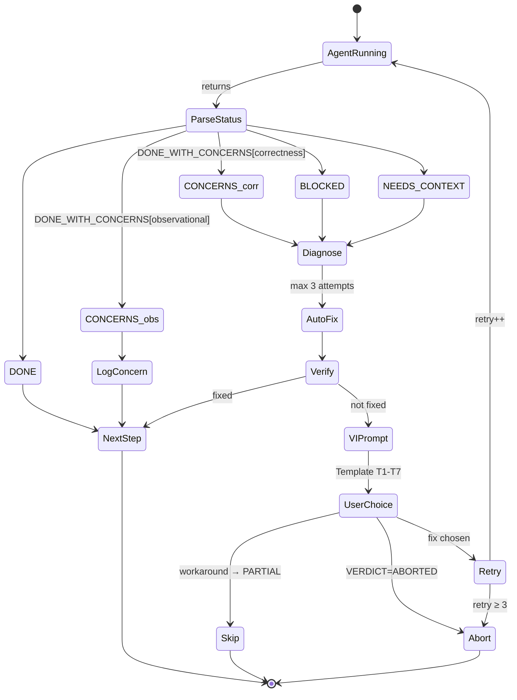
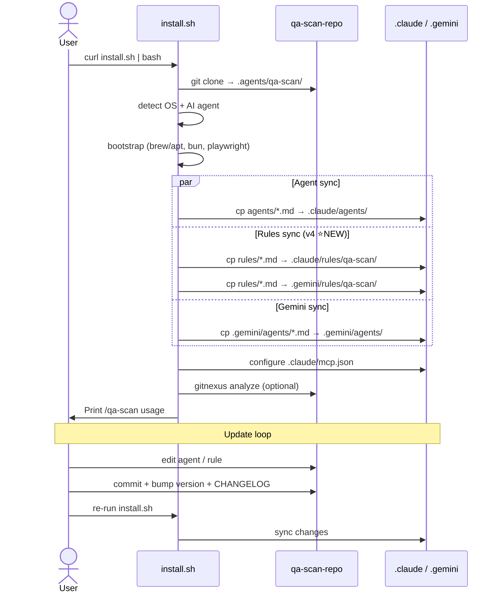

# QA Scan — Agentic QA Automation

Multi-agent QA pipeline with **enforced tool restrictions** and **coverage-driven testing**. Analyzes code to extract testable states, generates comprehensive Playwright tests, verifies coverage completeness.

Works with: **Claude Code** (native agents) | **Gemini CLI** (native agents) | **Antigravity** (workflow.md)

## Install

### Prerequisites

**Just need an AI coding agent** (one of):

```bash
# Claude Code (recommended)
npm install -g @anthropic-ai/claude-code
claude login

# Or: Gemini CLI, Antigravity, etc.
```

Everything else (git, Homebrew, system packages) installs automatically.

### 1-Command Setup

```bash
curl -fsSL https://raw.githubusercontent.com/cyberk-dev/qa-scan/main/install.sh | bash
```

The interactive wizard will:
1. **Auto-detect OS** (macOS/Linux) + **CI environments** (GitHub Actions, GitLab, etc.)
2. **Bootstrap system tools** (Xcode CLT, Homebrew on macOS; apt packages on Linux)
3. **Install core tools** (git, jq, gh) if missing
4. Auto-install **Bun** (if missing)
5. Clone qa-scan repo to `.agents/qa-scan/`
6. Ask: **Linear** or **GitHub Issues**? Configure auth (API key or OAuth)
7. Configure your project (URL, dev command, branch)
8. Auto-setup **MCP servers** (Linear + GitNexus → `.claude/mcp.json`)
9. Install **Playwright + Chromium**
10. Auto-install + index **GitNexus** (if enabled)
11. Detect AI agents and install: Claude + Gemini agents
12. Print usage instructions

### Options

```bash
# Non-interactive (uses template config, edit manually)
curl -fsSL https://...install.sh | bash -s -- --non-interactive

# Custom install location
curl -fsSL https://...install.sh | bash -s -- --dir ~/qa-scan

# Custom workspace root
curl -fsSL https://...install.sh | bash -s -- --project-dir /path/to/project
```

## Usage

### Claude Code
```
/qa-scan SKIN-101                    # Single issue
/qa-scan --all                       # All QA issues (batch)
/qa-scan SKIN-101 --post             # Single + post report to Linear
```

### Gemini CLI
```
/scan SKIN-101                       # Prompt template (recommended)
@qa-orchestrator scan SKIN-101       # Direct agent delegation
```

### Zero-Touch (auto-poll)
```bash
bash .agents/qa-scan/scripts/qa-orchestrator.sh --watch 600
```
Polls Linear every 10 minutes. Auto-tests new QA issues. Posts results + labels.

## How It Works

### Pipeline (v4)

```
Step -1: Pre-flight (Linear/GitNexus/Playwright MCP checks)
Step 0:  Project context (qa-context-extractor)
Step 0a: Env bootstrap ⭐NEW — install deps, setup .env, start services, spawn dev server
Step 1:  Fetch + analyze issue → test requirements (+VI confirm Step 1c)
Step 1d: GitNexus index
Step 2:  Scout + flow + routes + shapes ⭐MERGED — unified test matrix
Step 3:  Generate test → Playwright E2E
Step 4:  Run test → video/trace/screenshots
Step 5:  Coverage / adversarial verify
Step 6:  Synthesize report → VERDICT: PASS/FAIL/PARTIAL
Step 7:  Post results (--post) → Linear/GitHub comment + label
Step 8:  Update hotspot memory
```

**Key v4 changes:** Step 0a auto-bootstraps env (deps + services + dev server) so zero-config install works on fresh machines. Step 2 unified — qa-code-scout produces files + flows + routes + shapes + test matrix in one pass (former qa-flow-analyzer merged in).

### Flow Diagrams

#### D1 — Pipeline Flowchart



#### D2 — Escalation State Machine



#### D3 — Install Sequence



### Enforced Agents

Each agent has restricted tool access — cannot exceed its role:

| # | Agent | Access | Role |
|---|-------|--------|------|
| - | orchestrator | Read + spawn | Coordinates pipeline |
| 0 | context-extractor | Read-only | Extract project context |
| 0a | env-bootstrap ⭐NEW | Bash + Read | Install deps, setup .env, spawn dev server |
| 1 | issue-analyzer | Read-only | Extract test requirements |
| 2 | code-scout ⭐MERGED | Read-only | Files + flows + routes + shapes + test matrix |
| 3 | test-generator | Write evidence/ only | Generate Playwright tests from matrix |
| 4 | test-runner | Bash only | Execute test + capture video |
| 5 | coverage-verifier | Read-only, background | Verify test coverage completeness |
| 5 | adversarial-verifier | Read-only, background | Probe for edge cases/vulns (alt path) |
| 6 | report-synthesizer | Write report only | VERDICT: PASS/FAIL/PARTIAL |

### Feedback Loops

| Memory | Purpose |
|--------|---------|
| `evidence/hotspot-memory.json` | Tracks files with repeated bugs → extra-thorough tests |
| `evidence/flaky-memory.json` | Tracks bad selectors → auto-avoid in test generation |
| `evidence/qa-tracker.json` | Tracks scanned issues → prevents re-scanning |

### Post-QA Labels (auto-applied)

| VERDICT | Label | Action |
|---------|-------|--------|
| PASS | `qa-auto-passed` | Ready for release |
| FAIL | `qa-auto-failed` | Needs fix |
| PARTIAL | `qa-needs-manual` | Needs human QA review |

## Configuration

Edit `.agents/qa-scan/config/qa.config.yaml` (generated by wizard):

```yaml
repos:
  my-project:
    path: /path/to/your/project
    base_url: http://localhost:3000
    source: linear             # or github
    project_key: PROJ          # Linear project key
    branch: dev
    gitnexus: true             # Enable semantic code analysis
```

See `config/qa.config.example.yaml` for all options.

## Auto-Run (Cron)

### Simple (any OS)
```bash
bash .agents/qa-scan/scripts/qa-orchestrator.sh --watch 600
```

### macOS (launchd)
Create `~/Library/LaunchAgents/com.cyberk.qa-scan.plist` — see `workflow.md` for template.

### Linux (crontab)
```bash
*/10 * * * * cd WORKSPACE && bash .agents/qa-scan/scripts/qa-orchestrator.sh >> /tmp/qa-scan-cron.log 2>&1
```

## Quick Test (no Linear needed)

```bash
# Start test app
bun .agents/qa-scan/test-app/server.ts &

# Copy test config
cp .agents/qa-scan/test-app/qa.config.test.yaml .agents/qa-scan/config/qa.config.yaml

# Run QA scan
/qa-scan TEST-001 --repo test-app
```

## Governance (Maintainers)

`qa-scan-repo` là **single source of truth**. Workspace `.claude/agents/qa-*.md`, `.gemini/agents/qa-*.md`, `.claude/rules/qa-scan/*.md`, `.gemini/rules/qa-scan/*.md` chỉ là installed copies — **không edit trực tiếp**.

Update chain:
1. Edit source trong `qa-scan-repo/`
2. Commit + bump version (`package.json`) + update `CHANGELOG.md`
3. Re-run `install.sh` trong workspace → sync copies

Full rule: [`rules/update-workflow.md`](rules/update-workflow.md)

## Updating

Re-run install — pulls latest, preserves config:
```bash
curl -fsSL https://raw.githubusercontent.com/cyberk-dev/qa-scan/main/install.sh | bash
```

## Uninstall

```bash
# Remove agents + adapters (keep config + evidence)
bash .agents/qa-scan/uninstall.sh

# Remove everything
bash .agents/qa-scan/uninstall.sh --all
```

## File Structure

```
agents/          9 agent definitions (tool-restricted)
references/      10 prompt templates + verdict rules
scripts/         Playwright config, auth, orchestrator, webhook, verify
config/          qa.config.example.yaml
templates/       Report template
evidence/        Test artifacts, tracker, memory files
workflow.md      Pipeline reference (Antigravity fallback)
adapters/        Claude skill, Gemini command+skill, Antigravity adapter
test-app/        Dummy app for E2E testing
uninstall.sh     Clean removal script
```

## License

MIT — CyberK
